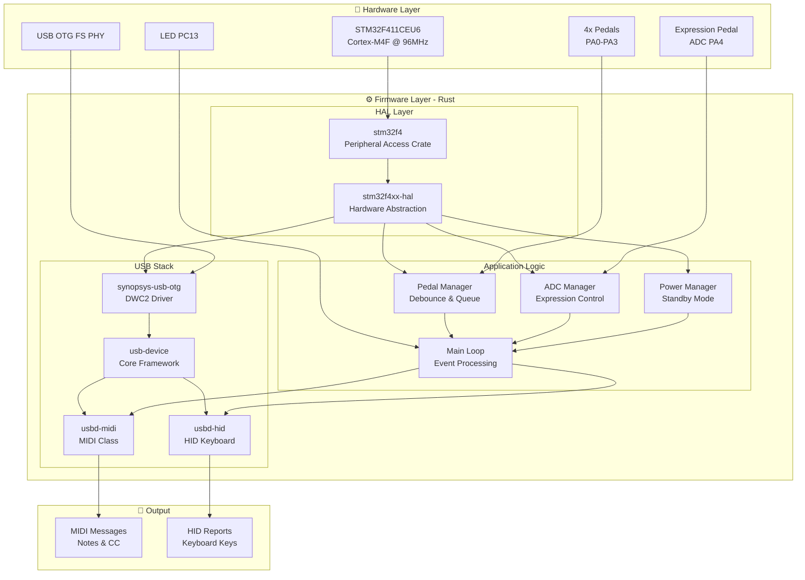
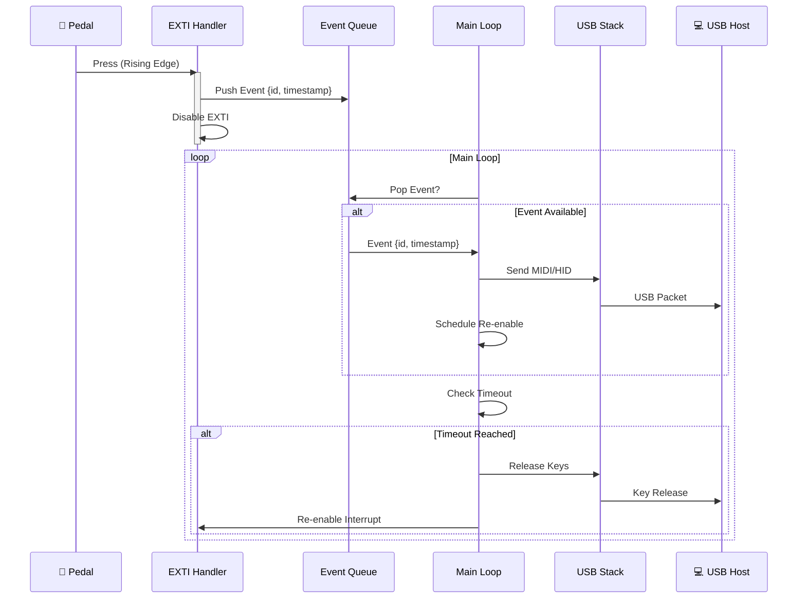
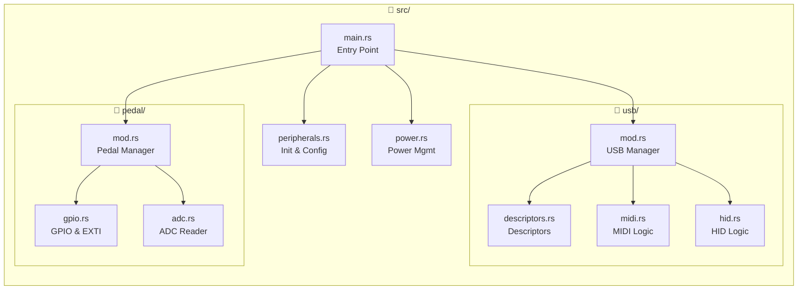
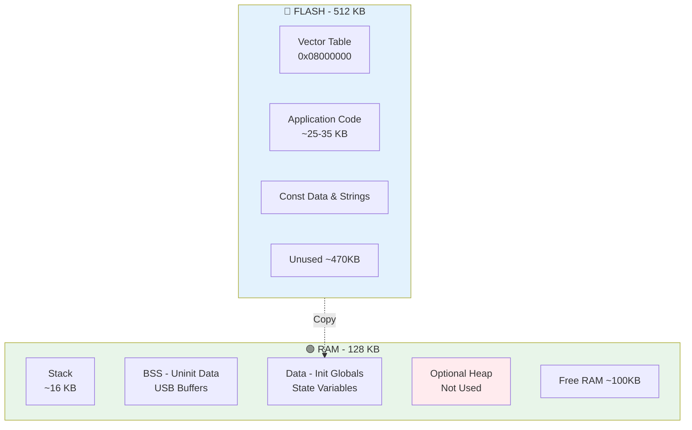
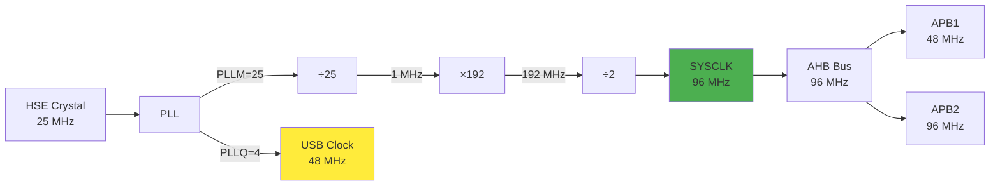

# Архитектура MIDI Pedal на Rust

## Диаграмма компонентов системы



## Поток данных педалей



## Диаграмма состояний USB

```mermaid
stateDiagram-v2
    [*] --> Detached
    Detached --> Attached: USB Cable Connect
    Attached --> Powered: VBUS Detected
    Powered --> Default: USB Reset
    Default --> Address: Set Address
    Address --> Configured: Set Configuration
    
    Configured --> Ready: Enumeration Complete
    
    state Ready {
        [*] --> Idle
        Idle --> SendingMIDI: MIDI Event
        SendingMIDI --> Idle: Sent
        Idle --> SendingHID: HID Event
        SendingHID --> Idle: Sent
    }
    
    Ready --> Suspended: No Activity 3ms
    Suspended --> Ready: Resume Signal
    
    Ready --> Detached: USB Disconnect
    Suspended --> Detached: USB Disconnect
```

## Архитектура модулей



## Карта памяти



## Временная диаграмма обработки событий

```mermaid
gantt
    title Timing Diagram - Pedal Press Event
    dateFormat X
    axisFormat %L ms
    
    section Hardware
    Pedal Press           :0, 1
    EXTI Trigger          :1, 2
    
    section Interrupt
    EXTI Handler          :2, 3
    Queue Push            :2, 3
    Disable EXTI          :3, 4
    
    section Main Loop
    USB Poll              :4, 5
    Queue Check           :5, 6
    Send MIDI/HID         :6, 7
    USB Transfer          :7, 10
    
    section Timeout
    Debounce Wait         :10, 14
    Key Release           :14, 15
    Re-enable EXTI        :15, 16
```



## Сравнение архитектур C++ vs Rust

| Компонент | C++ (Current) | Rust (Planned) |
|-----------|---------------|----------------|
| **HAL** | STM32 HAL (C) | stm32f4xx-hal |
| **USB** | TinyUSB | usb-device + synopsys-usb-otg |
| **MIDI** | Custom (TinyUSB) | usbd-midi |
| **HID** | Custom (TinyUSB) | usbd-hid |
| **Concurrency** | Manual (deque + interrupts) | Safe abstractions (Mutex + RefCell) |
| **Memory Safety** | Manual | Borrow checker |
| **Build System** | CMake | Cargo |
| **Размер кода** | ~30 KB | ~25-35 KB (estimated) |

## Приоритеты прерываний

```
Priority 0 (Highest)
    └── (Reserved for critical)

Priority 2
    ├── EXTI0 (Pedal 1)
    ├── EXTI1 (Pedal 2)
    ├── EXTI2 (Pedal 3)
    └── EXTI3 (Pedal 4)

Priority 6
    └── OTG_FS (USB)

Priority 15 (Lowest)
    └── SysTick
```

## Конфигурация тактирования


